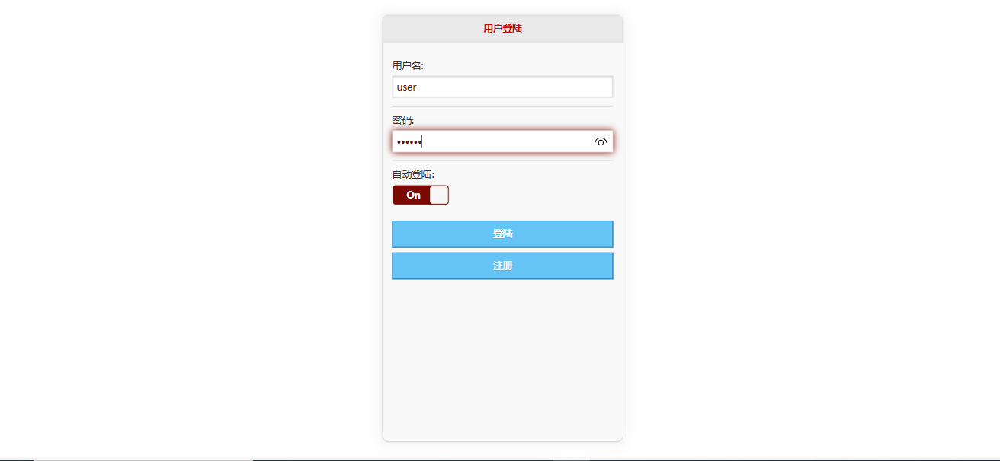
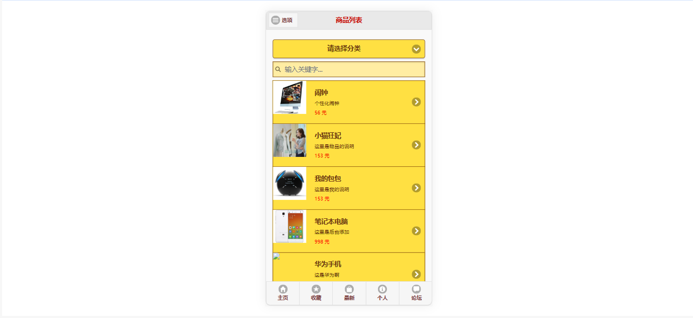
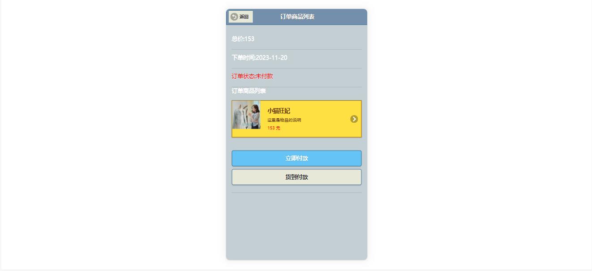
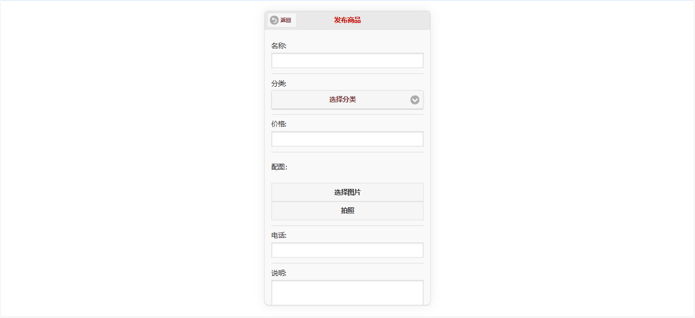
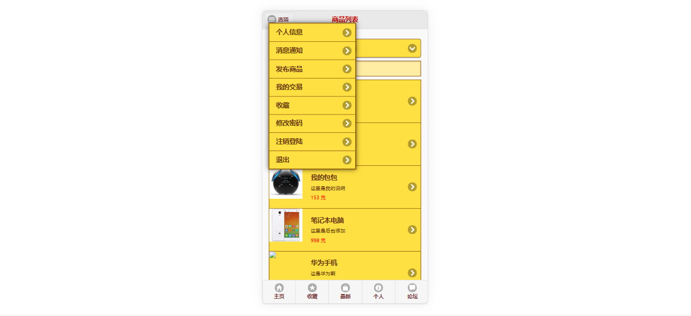
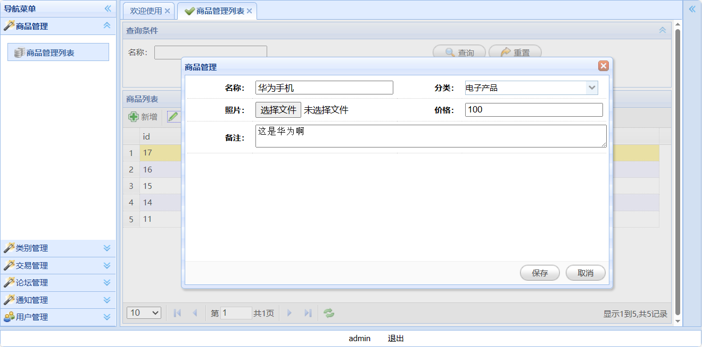
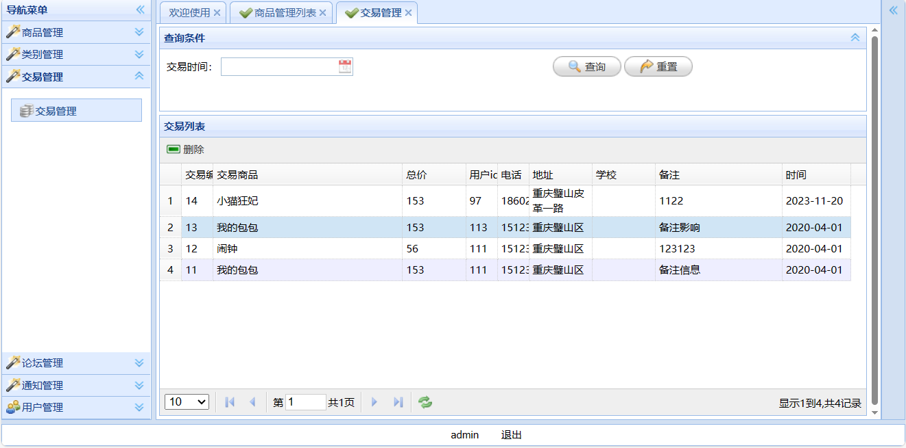

<h1 align="center">19.基于ssh的校园二手物品交易管理系统</h1>

- <b>完整代码获取地址：从戎源码网 ([https://armycodes.com/](https://armycodes.com/))</b>
- <b>技术探讨、资料分享，请加QQ群：692619798</b> 
- <b>作者微信：19941326836  QQ：952045282</b> 
- <b>承接计算机毕业设计、Java毕业设计、Python毕业设计、深度学习、机器学习</b>
- <b>选题+开题报告+任务书+程序定制+安装调试+论文+答辩ppt 一条龙服务</b>
- <b>所有选题地址 ([https://github.com/YuLin-Coder/AllProjectCatalog](https://github.com/YuLin-Coder/AllProjectCatalog)) </b>

## 项目介绍

基于ssh的校园二手物品交易管理系统：前端jsp、jquery、easyui，后端 struts、spring、hibernate，系统分为用户和管理员，用户可以在平台发布自己的二手物品，也可以购买别人发布的商品，支持在线付款和货到付款；主要功能如下：

### 用户：

- 基本功能：登录、注册、注销、密码修改、个人信息查看、个人信息修改
- 消息通知：通知列表、关键词搜索、通知详情
- 商品功能：商品列表、关键词搜索、分类选择列表展示、商品详情、商品提交、发布商品、商品图片上传、最新商品列表、商品评论
- 商品收藏：商品详情页面收藏、收藏列表、收藏删除
- 我的交易：交易列表、交易详情、立即付款、货到付款
- 论坛：帖子列表、关键词搜索、发布新帖、查看帖子详情、发表回复

### 管理员：

- 商品管理：商品列表、新增商品、修改商品、删除商品、名称关键词搜索
- 类别管理：类别列表、新增类别、修改类别、删除类别、名称关键词搜索
- 交易管理：交易订单列表、交易记录删除、根据交易时间查询记录
- 论坛管理：根据帖子名称搜索、帖子列表、帖子删除
- 通知管理：根据标题搜索、通知列表、新增通知、修改通知、删除通知
- 用户管理：根据用户名搜索、新增用户、修改用户、用户充值、删除用户

## 环境

- <b>IntelliJ IDEA 2009.3</b>

- <b>Mysql 5.7.26</b>

- <b>Tomcat 7.0.73</b>

- <b>JDK 1.6</b>

## 运行截图

